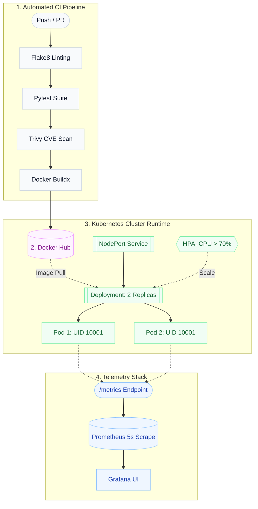
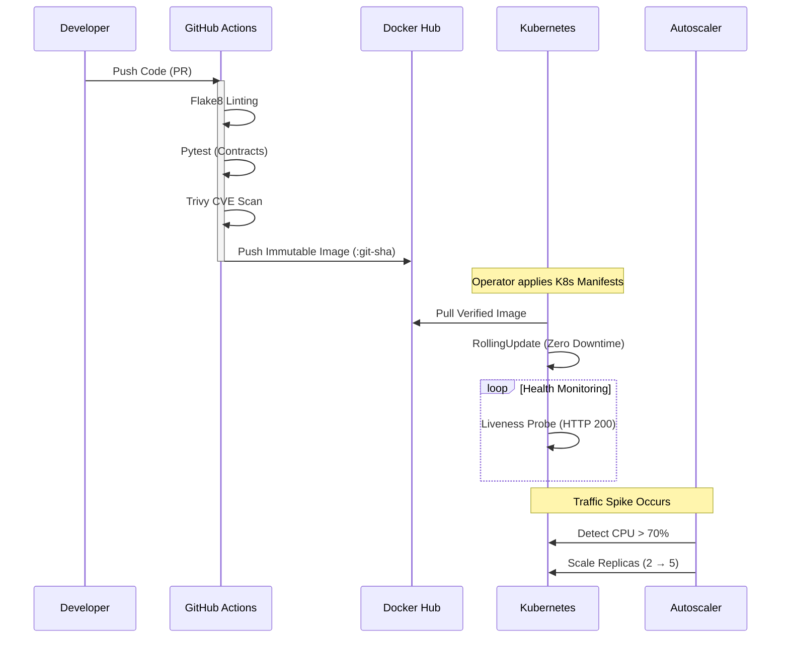

# 🚀 DevOps-Forge
**Enterprise-Ready Microservice Delivery & Runtime Blueprint**

> 🔐 Licensed under **MIT License**  
> 📌 Developed by **Sri Vighna Teja** | 2025

<div align="center">
  
  
  
  
  
  
</div>

---

## Executive Summary

DevOps-Forge is a comprehensive delivery and runtime architecture that transforms a standard Python application into a resilient, production-ready microservice. It establishes a fully automated CI/CD pipeline, enforces shift-left security, and orchestrates a self-healing Kubernetes runtime with autoscaling and real-time observability.

Designed to demonstrate core **Platform Engineering & DevOps** competencies, this project focuses on reproducible builds, strict resource boundaries, and telemetry-driven operational predictability rather than just assembling disparate tools.

---

## 🏗️ System Architecture & Delivery Flow

The system implements a decoupled, 4-tier operational model. It explicitly separates automated integration from declarative cluster management and observability.

### 1. Component Topology


### 2. CI/CD Lifecycle & Auto-Healing


---

## 💡 Engineering & Architectural Decisions

Every layer was chosen based on concrete operational constraints to balance security, performance, and maintainability:

| Component | Technical Implementation | Rationale & Tradeoff Analysis |
| :--- | :--- | :--- |
| **Concurrency** | **Gunicorn WSGI (2w/2t)** | Python's built-in server is single-threaded; one slow request blocks all users. Gunicorn provides concurrent request handling and graceful worker recycling without crashing the pod. |
| **Security** | **Non-Root Execution (UID 10001)** | Root containers create severe host-takeover risks if breached. Enforced at both the Dockerfile and Kubernetes `SecurityContext` layers to contain blast radius. |
| **Availability** | **Decoupled Probes** | Prevents cascading restart storms. Under heavy load, a slow service fails *readiness* (dropping traffic) rather than *liveness* (which triggers aggressive restarts). |
| **Isolation** | **Explicit CPU/RAM Limits** | Without hard limits, one memory-leaking pod can starve neighbor workloads. Explicit limits ensure deterministic K8s node scheduling and prevent noisy neighbors. |
| **Capacity** | **CPU-Driven HPA (2→5 pods)** | Statically sized replica counts result in idle overprovisioning waste or degraded service during spikes. HPA absorbs traffic bursts automatically. |
| **Auditability** | **Dual Tagging (`latest` + Git SHA)** | `:latest` is convenient but operationally opaque. Immutable Git SHA tags guarantee that any running container can be traced directly to the exact source commit. |
| **Security Gating**| **Advisory Trivy Scan** | Generates structured vulnerability artifacts in CI without blocking the pipeline (`exit-code: 0`). This prevents upstream base-image CVE spikes from halting critical hotfix delivery. |

---

## 🛡️ Validation & Implementation Evidence

Every claim in this blueprint is backed by verified automated checks mapping to industry standards (CIS Benchmark 4.1, SLSA Level 1):

```text
Commit → Flake8 static analysis (0 syntax errors, clean PEP-8)
       → Pytest suite (All contract assertions passed for /, /health, /ready, /metrics)
       → Aqua Trivy CVE scan (OS packages + Python dependencies)

Build  → python:3.9-slim base (minimal attack surface)
       → Dependencies installed before source copy (layer caching optimization)
       → Non-root user created (UID/GID 10001)

Runtime → runAsNonRoot: true enforced in K8s securityContext
        → CPU/memory constraints preventing resource exhaustion
        → Deployment, Service, and HPA YAML schemas verified valid
```

---

## ⚡ Quickstart & Reproducibility

### 1. Local Development Sandbox
```bash
git clone https://github.com/SRIVIGHNATEJA/DevopsSec.git
cd DevopsSec

python3 -m venv venv && source venv/bin/activate
pip install -r requirements.txt

flake8 . --exclude=venv,__pycache__,.pytest_cache
pytest -v
python3 app.py
```

### 2. Containerized Execution
```bash
docker build -t devops-project:local .
docker run -d -p 5000:5000 --name devops-app devops-project:local

# Verify API and internal metrics
curl http://127.0.0.1:5000/health
curl http://127.0.0.1:5000/metrics

docker stop devops-app && docker rm devops-app
```

### 3. Declarative Kubernetes Deployment
```bash
# Requires an active K8s cluster (Minikube / Kind)
kubectl apply -f k8s/

# Monitor rollout and HPA
kubectl rollout status deployment/devops-app-deployment
kubectl get pods,svc,hpa -l app=devops-app

kubectl delete -f k8s/
```

### 4. Telemetry Sandbox (Docker Compose)
```bash
docker-compose up -d
# Access Grafana at http://127.0.0.1:3000 (admin / admin)
docker-compose down
```

---

<div align="center">
  <i>Engineered to demonstrate production-ready systems architecture, deployment automation, and defensive cluster integration strategies.</i>
</div>
